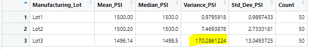

# MechaCar_Statistical_Analysis (Module Challenge 15)

[Link to MechaCar Challenge R code](MechaCarChallenge.R)

## Linear Regression to Predict MPG (Deliverable 1)

1. Which variables/coefficients provided a non-random amount of variance to the mpg values in the dataset?

   As illustrated in the table below, both the vehicle length and ground clearance variables provided a non-random amount of variance to the mpg values.
   
   The vehicle length and ground clearance have a significant impact on mpg values. Less so but perhaps still significant is the vehicle weight.
      
   

2. Is the slope of the linear model considered to be zero? Why or why not?

   The p-value of our linear regression analysis is 5.35e-11, which is less than an assumed significance level of 0.05%. 
   
   Therefore, there is sufficient evidence to reject the null hypothesis, which means that the slope of this linear model is not zero.

3. Does this linear model predict mpg of MechaCar prototypes effectively? Why or why not?

   Yes, this linear model is an efficient predictor of mpg based on the following results:
   
   * p-value is less than the assumed significance level of 0.05%, suggesting significant variable impacts
   * Multiple r-squared value is greater than 0.70, suggesting strong correlation

## Summary Statistics on Suspension Coils (Deliverable 2)

1.  The design specifications for the MechaCar suspension coils dictate that the variance of the suspension coils must not exceed 100 pounds per square inch.
    Does the current manufacturing data meet this design specification for all manufacturing lots in total and each lot individually? Why or why not?
    
    The current manufacturing data meets this design specification for all manufacturing lots.  The variance is 62.3 PSI.
    
    
    
    However, Lot 3 does not meet the design specification when considered individually.  The variance for Lot 3 is 170.3 PSI.
    
    
    
## T-Tests on Suspension Coils (Deliverable 3)
 
1. Determine if all manufacturing lots and each lot individually are statistically different from the population mean of 1,500 pounds per square inch. The assumed significance level is 0.05%. 
   
   The p-value of all manufacturing lots compared to the population mean is 0.06.  This is close enough to the significance level to conclude that the results *are*          statistically different from the population mean.
   
   
 
   The p-value of Manufacturing Lot 1 compared to the population mean is 1.0.  This is greater than the significance level, so it can be concluded that the results for    Lot 1 *are not* significantly different from the population mean.
   
   
   
   The p-value of Manufacturing Lot 2 compared to the population mean is 0.60.  This is greater than the significance level, so it can be concluded that the results for    Lot 2 *are not* significantly different from the population mean.
   
   
   
   Finally, the p-value of Manufacturing Lot 3 compared to the population mean is 0.04.  This is less than the significance level, so it can be concluded that the          results for Lot 3 *are* significantly different from the population mean.  This confirms the findings in Deliverable 2 that Manufacturing Lot 3 contains some          outlier results.
   
   

## Study Design: MechaCar vs Competition

This section contains a short description of a statistical study that can quantify how the MechaCar performs against the competition.

To compare its prototypes against competitive models, MechCar should seek to deliver a quality product.

1. What metric or metrics are you going to test?
   To test for quality, MechCar should test a new assembly line inspection procedure to determine if there is a change in the number of reported defects during the        first year of ownership per mile driven.

2. What is the null hypothesis or alternative hypothesis?
   The null hypothesis is that vehicles assembled using the new inspection procedure will have no change in reported defects during the first year of ownership over      competitive vehicles.
   
   The alternative hypothesis is that vehicles assembled using the new inspection procedure will have a reduction in reported defects during the first year of            ownership over competitive vehicles.
   
3. What statistical test would you use to test the hypothesis? And why?
   A single-sample t-test could be used to compare the statistical significance of mean defects per mile during the first year of ownership between vehicles assembled    using the new inspection procedure and the population of all competitor vehicles.
   
   A two-sample t-test could be used to compare the statistical significance of mean defects per mile during the first year of ownership between vehicles assembled        using the new inspection procedure and similar MechCar models assembled without the new procedure.
   
   A regression analysis could be used to predict the defects per mile driven during the first year of ownership based on the number of quality inspections completed    during assembly.

4. What data is needed to run the statistical test?

   This statistical test will require the following data:
   * Number of defects reported by vehicle owners during the first year of ownership
   * Number of miles driven by vehicles during the first year of ownership
   * Number of quality inspections completed during vehicle assembly under MechCar's new program

This project was prepared using the following:
* R 4.2.1
* R Studio 2022.02.3 Build 492
* dplyr library
* tidyverse library

